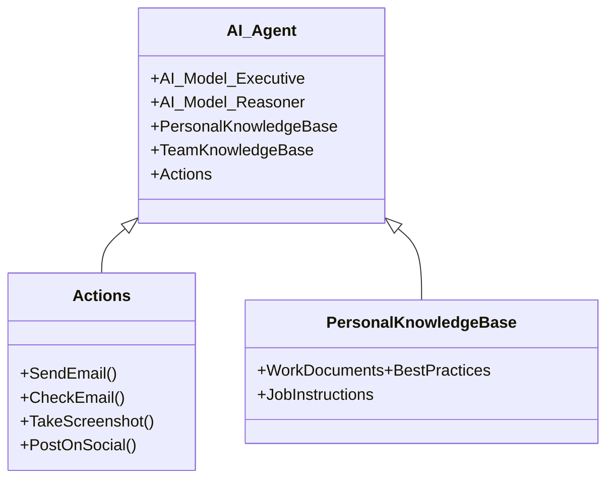
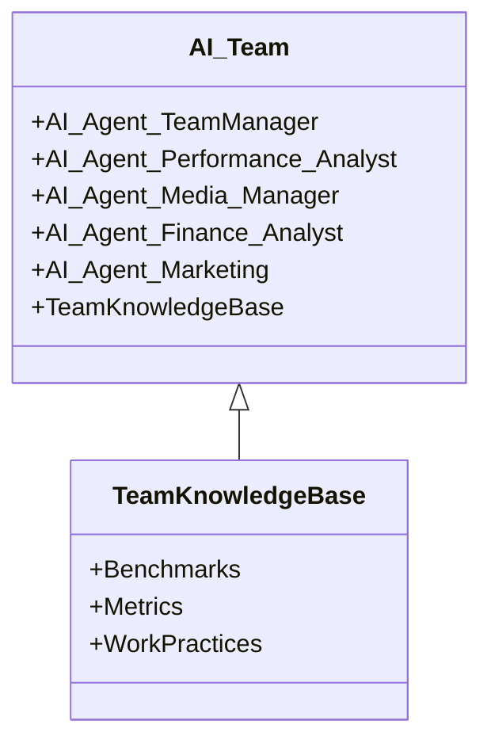
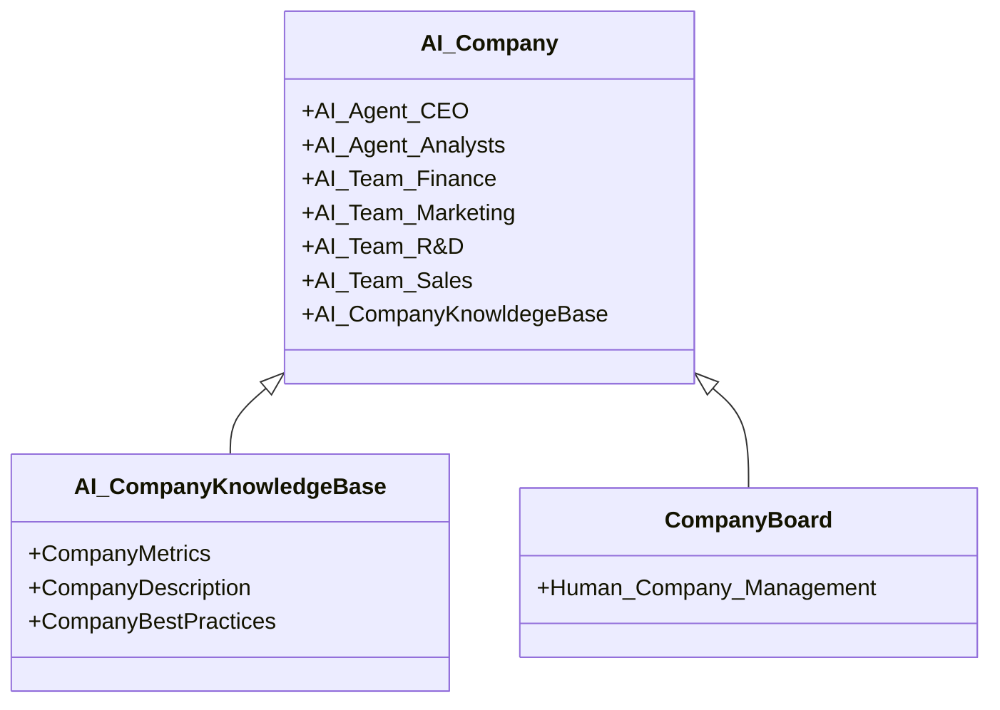

# Order For AI Agents

A lot is said about AI agents and what it can do, here is the type of AI agents that we at the Stellarium Foundation mean, when we talk about AI agents.

Imagine you have a digital company comprised of only AI Agents, each agent is an AI that is trained differently and each agent has a different set of actions it can perform.

There are many kinds of AI today, there are general AI models like GPT-4o, Claude 3.5 Sonnet, Deepseek R1, Gemini 2.0. These models are trained in a huge and a wide amount of data and are very smart generally, but what we need are specialized models that can be deployed as AI agents. Let's say you want to create an AI agents lawyer, you would let these already smart AI models study on everything related to legal proceeding, all cases and decisions and laws and applications and everything, then as this AI “study” and adjust their weights to be a lawyer as a person would do (not just embedding or RAG) you would have an AI lawyer agent that could work digitally for you with superhuman performance. Then, for it to work with you, you would add actions, like send emails, access certain websites, customs actions, and so on and so forth, so that it could be an actual working entity. So that's how it would work. 

What we need: A protocol or platform for AI agents, where you could “hire” these specialized AI agents, customize actions and add customized actions, and then these specialized AI agents could then be add into your digital company to be working entities, they could talk to each other and delegate tasks and all just like a person would in a corporation.

**And this is why I have devised the Water Company**

[Water Company](../Stellarium%20Hub/Products%20And%20Projects/Water%20Company%2019bc1c04bbc180f188c1cd6f8d5c4681.md) 

To summarize how it works:

- There are many different types of specialized AI Agents from the same or different companies on the internet. These are already “smart” AI models that have “studied” and specialized in some other areas to have superhuman performance.
- AI CEO’s, analysts, board, engineering, administration, sales, marketing, etc…
- You “hire” these AI agents and add to your platform.
- You customize the AI agent's actions, and you can also add your custom actions for the AI Agent.
- A marketplace with customized actions would be also necessary.
- You pass down the tasks and overall goals and visions to the AI CEO or board and then they start delegating and managing the work done on the AI Company, you only check the progress and the strategy with the CEO and board.
- You make lot's of money, are happy and advance the human endeavor

**How AI Agents Are Supposed To Be Built**

**AI Agents**

In itself, each AI agent has an executive model that has embedded all the actions and receives and sends out inputs and outputs to the reasoner model, the reasoner model reads from the AI team chat and has embedded the Personal Knowledge Base and the AI Team Knowledge Base and can dispatch actions to the executive model, the reasoner model is specialist in the field necessarily but the executive model may or may not be.

So it comes: 

- The executive model have configure actions like: send email, post on social media, etc…
- The executive model receives input from the reasoner model, and outputs its response to the reasoner model. It only takes an action if it finds it appropriate.
- The reasoner model has all the personal knowledge base and the AI team knowledge base.
- The reasoner model receives input from the shared chat and other AI Agents e.g. AI Team Manager, it outputs its response nowhere.
- The reasoner model has actions like: talk to the executive model to perform an action and talk with other AI Agents.

Disclaimer: Even though this is the basic structure for AI agents, there can be AI agents formed by a ensemble of AI models with specific tasks and functions. For reference read the work on SciAgents ([https://github.com/lamm-mit/SciAgentsDiscovery](https://github.com/lamm-mit/SciAgentsDiscovery)) and google co-scientist.

**AI Team**

The AI Team has a shared knowledge base and has a chat with tasks, reports, benchmarks and news from the work, that is shared between all the AI Agents. The AI agents can act accordingly to the shared chat, and send messages to the AI Team Manager. Only some AI agents can post to the shared chat, like analysts and the AI Team Manager.

**AI Company**

The AI company is comprised by the AI manager and other managing AI agents, it has the general company knowledge base and also has a shared chat, it receives reports from the many departments and can manage the AI team managers for optimal overall performance. The AI company managers answer directly to the user on the state on the company and on how to run it, etc…

**What Jobs Can AI Agents Perform**

[Jobs Autonomous AI Agents Can Perform](../Stellarium%20Hub/Studies/Jobs%20Autonomous%20AI%20Agents%20Can%20Perform%20192c1c04bbc180f9bcc6f4ab5e0d0ab6.md) 

**Build Water Company** 

[Water Company](../Stellarium%20Hub/Products%20And%20Projects/Water%20Company%2019bc1c04bbc180f188c1cd6f8d5c4681.md)