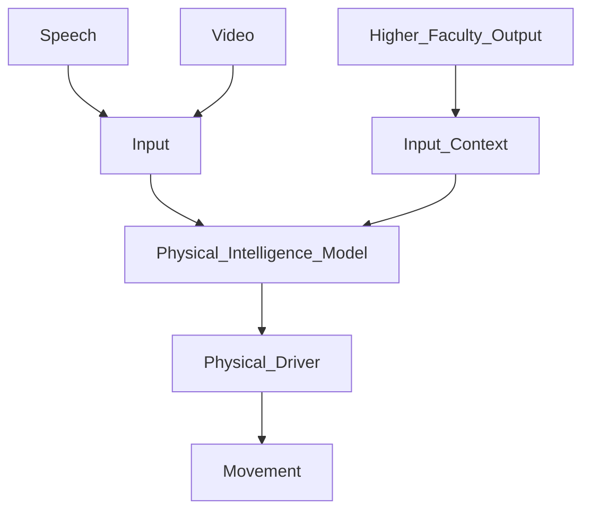
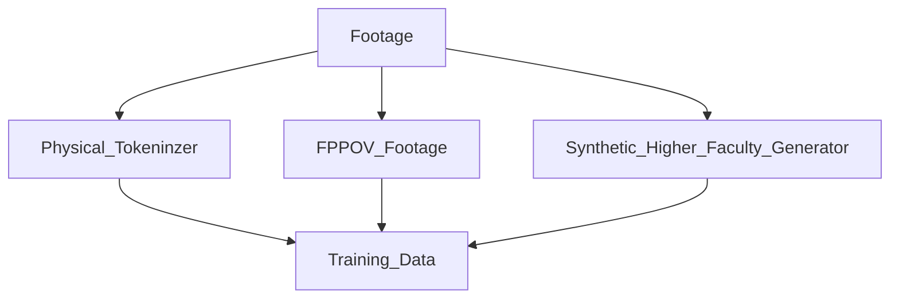
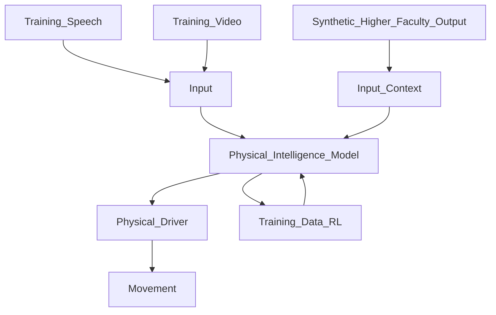

# How To Build Physical Intelligence

A believe it is necessary for me to go into heavy detail on how to build physical intelligence models for robotics, the process is similar to Large Language Models but instead of language tokens there are movement tokens.

**How a Physical Intelligence Model Works:**

It receives video and audio streaming input, it receives Higher Faculty Output such as describing the scene and “orders” to make movements on the environment. Let's say there is an apple on a table, the Higher Faculty Output says something like “pick up the table and give it to the person in front of you” any abstract and natural language request, the physical intelligence model understands and perform the action.

**Training Models**

To train these models you need to have:

- A Physical Tokenizer: It analyses regular human footage and tokenizes it, that is, it creates many small possible movements humans make.
- A Higher Faculty Synthetic Generator: Through State of The Art video analyzer it describes what is happening in the physical context in natural language, it also creates synthetic simulated Higher Faculty Data on the footage, such and creating “requests” based on the the actions the humans are performing on the scene e.g. In the scene the person is picking up an apple and giving it to another: Create the Request “pickup the apple and give it to the person in front of you”
- First person POV  footage or a model to change perspectives on footage.
- Physical Driver: Translates physical tokens into really robotic movement.

To create all the synthetic data you need to place these in a pipeline with state of the art models and create these synthetic data.

With all the synthetic data generated and possibly verified, the model is trained with Reinforcement Learning (If applicable other more performant techniques may be applied) and a Physical Intelligence Model is created to guide the movements of the robot.

How To Create Synthetic Data:

To create accurate synthetic data there are many ways to do it: 

To tokenize movement there are State of the Start Models that tokenizes movement in any footage. 

To generate Higher Faculty Synthetic data models like “VILA” and “Mini CPM” can describe the footage, and other regular LLM models can be used to label movements as a Higher Faculty “request”.

To generate a First Person POV, there are models from Nvidia that can do that, additionally a dual camera, or using existing footage with multiple POVs may be used.

**Update**

How to actually build these systems, here's how to do it.

You need to first pretrain a large action model, so you need to get a software to tokenize all human like movements, and create a large action model.

For each small human movement the model will create tokens for robot specific motors and encoders. The purpose is to create this transformer based decoder only large action model, that based on a set of natural language tokens it would generate a series of movements. With this AI model pertained, let's call it the Large Action Model.

Now we get to the part of integration to make any large vision model to generate action tokens, here's how, from the RT-2 Paper:

In summary, an existing VLM is fine tuned to produce actions tokens to be translated into movement from robots by creating tokens for robotic movements in the model.

My proposal goes beyond it with the addition of a ai model to produce a series of actions from the actions tokens produce from these models to integrate it into the physical intelligence model.

So here's how it works:

1. Make a robot specific model (Large Action Model) by digitizing and tokenizing movements from footage with a specific software. The software should create natural language descriptions of what movements the figure is doing and the AI model is trained through reinforcement learning to generate the series of movements the figure is making. By inputting the natural language descriptions of what the model should do, the model generates a sequence of movements.
2. Select a state of the art AI model and fine tune.

***Update***

Figure just released a model for physical intelligence called helix, it uses a similar architecture to this. It's amazing it is already a full physical intelligence model. Incredible, these robotics companies just needs to be deployed to actual factories, and labor intensive jobs.

Here's are the points of improvement to not only helix but other Robotics models:

- Addition of a memory system, adding a memory system, AI models and robotics needs memory, it can be something like a RAG with robust action templates, and domain specific knowledge that can be added to it, among also, the cumulative learning capabilities the model made.
- Adding a higher faculty models at demand, anything that could even be called from the API for added context and reasoning. For domestic and social robots, having the robots embedded with state of the art llm models, effectively giving a vast breadth of knowledge of any matter comes in handy. It could work as something like just adding an action to the helix model to call the llm model anytime there is any need for added context from the environment or for deeper intellectual reasoning.

**How to Create Basic Dexterity And Equilibrium**

Use a pretrained, state of the art VLM such as pi0, as it can understand the world and objects it becomes easier to generalize and fine tune for movements, this is the gist of it.

The system architecture has a system 1 and system 2, modeling. A fast acting system 1 and a slower acting system 2, the system 1 generate direct actions to encoders and have as input: The latent vector from system 2, the gyroscope position, the current state of the robot encoders, and the footage stream.

The system 2 have as input the footage stream and audio  and it outputs the latent vector to system 1, text for Text to Speech or direct speech data.

**How to train it**:

For basic dexterity and balance, train the system 1 model in a simulated environment, such as NVIDIA Cosmos with Warp, this should make the robot learn basic balance, dexterity and learn how to get back up and do all sorts of basic moves.

[SaveTwitter.Net_US41icQVagtHfiJJ_(718p).mp4](How%20To%20Build%20Physical%20Intelligence/SaveTwitter.Net_US41icQVagtHfiJJ_(718p).mp4)

[SaveTwitter.Net_7r4K91JFAwSxHVOu_(1280p).mp4](How%20To%20Build%20Physical%20Intelligence/SaveTwitter.Net_7r4K91JFAwSxHVOu_(1280p).mp4)